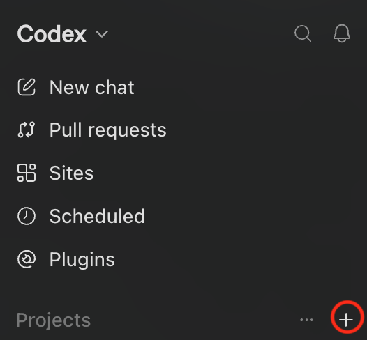

# Agentic AI for Knowledge Work: Introduction and Setup

### Learning Objectives

- Distinguish a chat assistant from an agent.
- Download the Codex app and open the workshop project.
- Connect Gmail, Google Calendar, and Google Drive, and explain what access you are granting.
- Create an `AGENTS.md` file that sets the rules for your agent.
- Explain what permission settings do and why they matter.

### Icons Used in This Notebook
🔔 **Question**: A quick question to help you understand what's going on.<br>
🥊 **Challenge**: Interactive exercise. We'll work through these in the workshop!<br>
💡 **Tip**: How to do something a bit more efficiently or effectively.<br>
⚠️ **Warning:** Heads-up about tricky stuff or common mistakes.<br>

### Sections
1. [What Is an Agent?](#section1)
2. [Set up Codex](#section2)
3. [Open Your Project](#section3)
4. [Connect Your Google Account](#section4)
5. [Give Your Agent Rules](#section5)

<a id='section1'></a>

# What Is an Agent?

You have probably used a chatbot like ChatGPT or Claude. You type into a box, and the chatbot generates an answer.

Using a chatbot in your workflows often involves a lot of time spending copying and pasting or attaching and downloading files. If you want feedback on an email, or you need a spreadsheet reviewed, you, as the human, have to transfer the relevant materials to the chatbot so that it can perform the task.

An **agent** is different in one major way: it can take actions for you. It can read your files, search your inbox, write a document into your Google Drive, put an event on your calendar, and send an email. When using agents, the need to copy and paste content almost vanishes. The agent can take actions to ensure it obtains the relevant context for a task.

Agents became popular in 2025 because they were so useful for programming. However, the usefulness of agents has become more general. We'll explore some of those use cases for knowledge work in this workshop. We'll specifically work with [Codex](https://chatgpt.com/codex/), developed by OpenAI.

There are a few things to keep in mind when working with agents:
- The agent works inside a **project folder** on your machine, plus whatever accounts you **connect** to it.
- Everything it does is **recorded**. You can inspect every step it took.
- It asks for **permission** before doing things like sending email or editing files.

🔔 **Question:** You ask a chatbot to "invite the lab to Thursday's talk." You ask an agent the same thing. What is the difference in what happens next?

<a id='section2'></a>

# Set up Codex

We are using the **Codex app** in this workshop. It merged with the ChatGPT app, so you may already have it downloaded. It's free to use with an OpenAI account.

1. Download and install the [Codex/ChatGPT](https://learn.chatgpt.com/docs/app) app.
2. Open the app and sign in.

## The Interface

*Note that the description of the interface may be outdated, as UI development for AI products moves very quickly!*

The Codex app is actually two apps: **ChatGPT** is the chatbot, and **Codex** is the agent that lives alongside it. A single toggle, located in the top left of the app, switches between them.

<center>

</center>

Within ChatGPT, there is another toggle: Chat and Work. Chat is the familiar chatbot. Work is a sort of "Codex lite" where an agent can take actions for you, but is less focused on coding.

<center>

</center>

You shouldn't worry too much about these distinctions. All signs indicate that AI products are converging on the "agent" setup where you simply talk to an agent, and it takes actions for you. **We will be working in the "Codex" setting today**, because it gives us a project folder, rules, and skills.


The **sidebar** on the left has shortcuts at the top (`New chat`, `Pull requests`, `Sites`, `Scheduled`, `Plugins`). Two of these matter today: `Plugins` (this lesson) and `Sites` (lesson 4). The two sections below them:

- `Projects`: the folders you've opened. A project bundles a folder with all the conversations you've had about it.
- `Recents`: your recent conversations.

At the bottom is the **text box**, where you talk to the agent. Type what you want in plain language and hit enter.

## Model and Effort

Inside the text box there's a small chip that reads something like `5.6 Sol High`. That's two settings: which **model** is doing the work, and how much **effort** it puts in.

<center>


</center>

- **Model** is which "brain" you're using. Bigger and newer models are more capable, but use up your usage limits faster.
- **Effort** is how long the model gets to think. Higher effort helps on hard tasks, and also burns limits faster.

For today, the defaults are fine. If you hit the free tier's usage limits partway through, switch to a smaller model or lower effort rather than stopping.

<a id='section3'></a>

# Open Your Project

The workshop materials you downloaded include a `packet/` folder: an event template, a list of attendees, and a rules file. The agent needs to see these, so we open the downloaded workshop folder as our project.

1. In the app, switch the toggle to `Codex`.
2. Click the `+` next to `Projects` in the sidebar, and choose the `Agentic-AI-Knowledge-Work` folder you downloaded (on your Desktop, if you followed the installation instructions).

<center>

</center>

3. Make sure the agent is set to work **locally** - on your computer, not in the cloud.

The project should now appear under `Projects` in the sidebar.

💡 **Tip:** If the app only offers to create a brand-new project, create one called `speaker-series`, then drag the `packet` folder from the download into the new project folder. Not sure where that folder is? Ask the agent: "What folder are we in? Give me the full path."

## Conversations

Inside a project, your work is organized into **conversations**. Hover over your project in the sidebar, and click the "New Conversation" icon to start one.

The paradigm to internalize is **one conversation = one task**. Planning the talk is a task - that's a conversation. Inviting attendees - another conversation. When you move on to a new task, start a new conversation.

- **Files persist across conversations.** Anything the agent created earlier is still in the folder (and in your Drive).
- **New chats do not automatically have context.** A new conversation starts fresh. The main thing the agent receives is the contents of AGENTS.md; otherwise, if the agent needs context, it will need to search for it.

## Permissions

Permissions specify how much leeway an AI has to take actions. There is a specific UI element that allows you to adjust this. Click on the "Approve for me" chip to see other options:


- **`Ask for approval`**: always ask before editing external files, using the internet, or acting through a plugin.
- **`Approve for me`**: the agent reviews its own requests, and only asks about actions it detects as risky.
- **`Full access`**: unrestricted. The agent has full access to the internet and any file on your computer.

⚠️ **Warning:** Set it to `Ask for approval` today. This is the setting that lets you read an email before it goes out.

<a id='section4'></a>

# Connect Your Google Account

In order for an agent to be able to take actions, it has to be connected to the relevant accounts. OpenAI facilitates this in Codex with "Plugins". We will use the Gmail Plugin to connect Codex to an email account.

⚠️ **Warning:** Decide now which account you're connecting. If you'd rather not connect your everyday Google account to an AI product, use the fresh account you created before the workshop. If you did not create a new email, use this time now to create a fresh Google account.

1. Click `Plugins` in the sidebar.
2. Find `Gmail` and click `Add`. A Google sign-in window opens.
3. Sign in with the account you chose. Google then shows a **consent screen** listing exactly what you are granting.

<!-- TODO(screenshot): the Plugins page with Gmail, Google Calendar, and Google Drive visible.
     Save as images/codex_plugins.png and uncomment: -->
<!--  -->

**Stop and read the consent screen.** It will say things like:

> Read, compose, send, and permanently delete all your email from Gmail

> See, edit, create, and delete all of your Google Drive files

<!-- TODO(screenshot): the Google consent screen for the Gmail plugin, showing the scope list.
     Save as images/google_consent.png and uncomment: -->
<!--  -->

This is the honest answer to "what am I giving ChatGPT?" - everything on that list. The permission setting from the last section (`Ask for approval`) is what stands between "can" and "does."

4. Click `Allow`. Repeat for `Google Calendar` and `Google Drive`. (Depending on your version of the app, these may be bundled into one `Google Workspace` plugin - one sign-in covers all three.)

💡 **Tip:** You can take this back at any time. Go to [myaccount.google.com](https://myaccount.google.com) → `Security` → `Your connections to third-party apps & services`, and remove the ChatGPT/Codex connection. Do this after the workshop if you used your everyday account and don't plan to keep using the agent.

## 🥊 Challenge 1: Meet Your Agent

Not sure what the agent can do now? *When in doubt, ask the agent.* Start a new conversation and try:

```
Gmail, Google Calendar, and Google Drive are connected. What kinds of things can you do for me now? What can't you do?
```

What does it tell you? Did it mention anything you didn't expect?

<a id='section5'></a>

# Give Your Agent Rules

Agents follow instructions you put in a special file called `AGENTS.md`. Think of it as a note pinned to the wall of the project: the agent reads it every time it starts working.

In the research workshop, the rules are about data. Here, they're about communication - and the most important one is **draft first, send only when I say so.**

The packet includes a ready-made rules file. Copy and paste this prompt:

```
Copy packet/AGENTS.md to the top level of this project as AGENTS.md. Then read it back to me and tell me, in one sentence each, how each rule will change how you work.
```

The rules it will find:

```
# Project rules

## Email and calendar
- Always show me a draft before sending any email or calendar invite, and wait for my approval.
- Only send email to addresses on the attendee sheet or to the confirmed speaker.
- Never delete or archive anything without asking.
- Only read emails that mention "Speaker Series" unless I say otherwise.

## Files
- Save everything for this event in a Google Drive folder called "Speaker Series" and in this project folder.
- Credentials live in credentials.txt. Read it when a task needs them, but never print its contents.

## Workflow
- Propose a plan before taking any action that sends, creates, or changes something.
- After acting, state exactly what you did: what was sent, to whom, and what was created.
```

🔔 **Question:** Which of these rules would you want in place for your own inbox? Which one would you drop?

💡 **Tip:** `AGENTS.md` steers the agent, but it is not a guarantee. Instructions can get lost in long conversations. The permission setting is the backstop: with `Ask for approval` on, nothing goes out without you clicking.

# Key Points

- An **agent** can take actions on your behalf: reading files, searching email, creating documents, sending messages.
- Connecting a plugin grants real access. Read the consent screen, and know how to revoke it.
- Keep **permissions** on ask-before-acting while you're learning.
- `AGENTS.md` holds rules your agent follows in every conversation. Today's most important rule: draft first.
- If you don't know what to ask, ask the agent what to ask.
