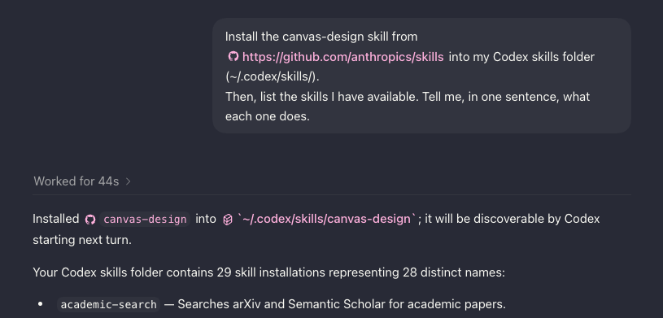

# Agentic AI for Knowledge Work: Publish Your Event

### Learning Objectives

- Explain what a skill is, how to install one, and where they can be found in Codex.
- Compare a flyer made with and without a skill.
- Recognize that an agent can work on plain files with no plugin involved.
- Describe what ChatGPT Sites does.

### Icons Used in This Notebook
🔔 **Question**: A quick question to help you understand what's going on.<br>
🥊 **Challenge**: Interactive exercise. We'll work through these in the workshop!<br>
💡 **Tip**: How to do something a bit more efficiently or effectively.<br>
⚠️ **Warning:** Heads-up about tricky stuff or common mistakes.<br>
✅ **Expected result**: What you should see if things went right. Small differences are fine; big ones are worth investigating.<br>

### Sections
1. [What Is a Skill?](#section1)
2. [Install a Skill: The Flyer](#section2)
3. [🎬 Demo: Creating an Event Page with ChatGPT Sites (Optional)](#section3)

<a id='section1'></a>

# What Is a Skill?

So far, you've written every prompt from scratch at the time you needed it. But what if you expect to do a task repeatedly? It doesn't make sense to rewrite the prompt over and over again, or even copy and paste it. A **skill** is a way to write a workflow once and reuse it.

Concretely, a skill is just a folder containing a file with instructions. The file is called `SKILL.md`. The file describes the skill, including what steps an agent should take if it's invoking the skill.

For Codex, all skills live in a single folder on your computer (for Macs, the default location is `~/.codex/skills/`). When you give the agent a task, it reads the descriptions of the skills it has access to and, if needed, uses one. You can also ask the agent to directly use a skill.

Nothing fancy! Skills are just repeated instructions that an agent knows to look for, when you tell it to or when the task matches the skill's description.

People publish skills the way they publish recipes. There are now [directories](https://www.skills.sh/) of skills you can install. In this part, we're going to install a skill and use it to create a flyer.

🔔 **Question:** `AGENTS.md` is also instructions in a file. What's the difference between a rule in `AGENTS.md` and a skill?

<a id='section2'></a>

# Install a Skill: The Flyer

Your talk needs a flyer. An agent can make one without any skill. Start a **new conversation** and try:

```
Make a one-page flyer for the talk in the event doc. Include the title, speaker, date, time, location, and a one-sentence hook from the abstract. Save it as flyer-v1.pdf in this project folder.
```

Open it. Keep it around; you will compare it with the next one. A skill focused on design principles might do better, so let's set one up.

Start another **new conversation**:

```
Install the canvas-design skill from https://github.com/anthropics/skills into my Codex skills folder (~/.codex/skills/).

Then, list the skills I have available. Tell me, in one sentence, what each one does.
```

You might see something like the following:



💡 **Tip**: Installing a skill may hit a permission prompt or need Python. If you get stuck, ask the agent how to get past it.

✅ **Expected result:** The agent downloads the skill, and includes it in the list. You can also open the skill in a text editor, like VS Code. Ask the agent for the path to the skill if you can't find it.

Now, let's use it:

```
Using the canvas-design skill, make a one-page flyer for the talk in the event doc. Include the title, speaker, date, time, location, and a one-sentence hook from the abstract. Save it as flyer-v2.pdf in this project folder, and put a copy in the Speaker Series folder in Drive.
```

Open both flyers side by side.

🔔 **Question:** What changed between v1 and v2? Open the skill's `SKILL.md` and find the line responsible. Then compare with other participants' flyers: share a screenshot in the chat, or show the people near you. Where do the differences come from?

💡 **Tip:** Notice that this task never touched Gmail or Calendar. The agent read a Google Doc, then worked on a plain file on your computer. Most of what an agent does for you won't need a plugin at all.

## 🥊 Challenge 4: Explore New Skills

Explore the [skill directory](https://www.skills.sh/) (or find a different one - there's plenty online). Find some new skills that seem interesting to you. Look at the `SKILL.md` for these skills. Pick one, ask your agent to install it, and give it a task that uses the skill.

<a id='section3'></a>

# 🎬 Demo: Creating an Event Page with ChatGPT Sites (Optional)

**ChatGPT Sites** allows you to build and host a website. Agents could already write the code for a website. Sites also puts it online, so you don't have to find hosting.

⚠️ **Warning:** Sites requires a paid ChatGPT plan, so this part is a demo. If you're on a paid plan, follow along.

If you'd like to try ChatGPT Sites, install the `Sites` plugin from the `Plugins` page. It then appears in the sidebar. Open a new chat, and try a prompt like:

```
Build an event page for the talk in the event doc: title, speaker and bio, abstract, date, time, and location. Add an "RSVP" button that opens an email to me. Show me a preview before publishing.
```

ChatGPT will build the code for the website, and finally give you a link that anyone can open.

🔔 **Question:** Who would you send this page to? What would you need to change in the prompt before it was good enough for that?

# Key Points

- A **skill** is a folder with a `SKILL.md` file containing reusable instructions for a specific task you expect to do repeatedly.
- An agent can install a skill for you.
- Agents have now developed capabilities for a wide array of tasks, including graphic design.
- ChatGPT Sites can publish a webpage given a prompt. It handles the hosting for you.