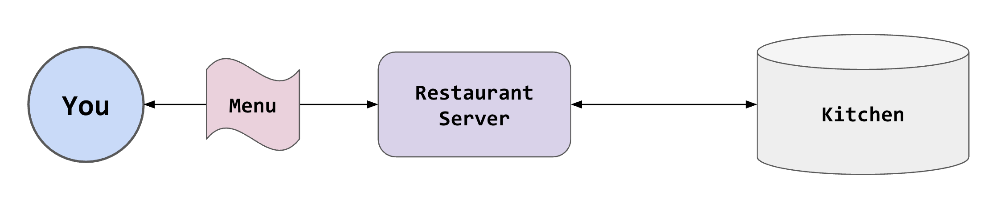
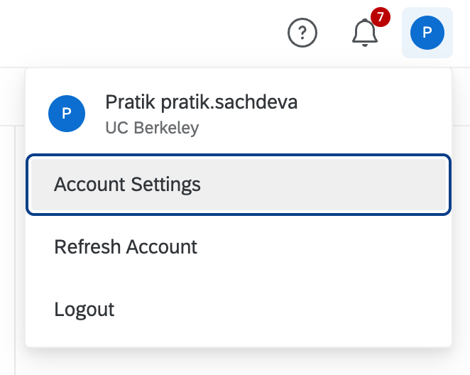
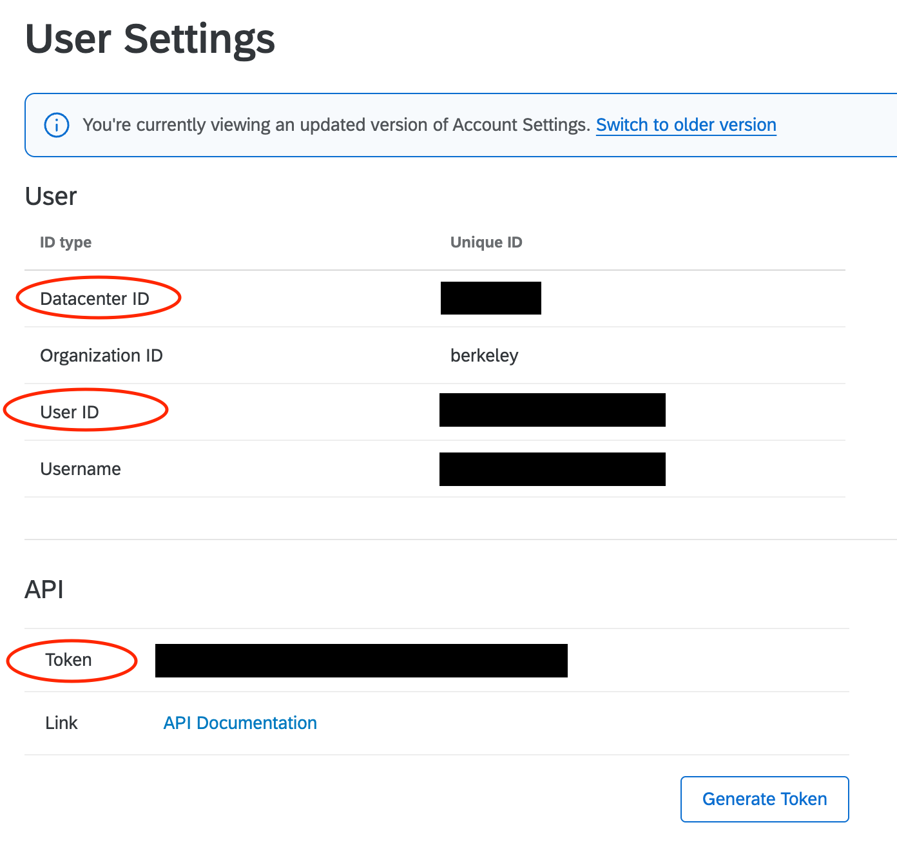

# Agentic AI for Knowledge Work: Beyond Plugins and Automation

### Learning Objectives

- Connect an agent to a service that has no plugin, using an API token.
- Store a credential in a file the agent can use without revealing it.
- Create and collect a survey through an agent.
- Have an agent fill out a web form through its browser.
- Decide how much autonomy a task needs.
- Write a skill that turns today's tasks into one reusable command.

### Icons Used in This Notebook
🔔 **Question**: A quick question to help you understand what's going on.<br>
🥊 **Challenge**: Interactive exercise. We'll work through these in the workshop!<br>
💡 **Tip**: How to do something a bit more efficiently or effectively.<br>
⚠️ **Warning:** Heads-up about tricky stuff or common mistakes.<br>
✅ **Expected result**: What you should see if things went right.<br>

### Sections
1. [When There Is No Plugin](#section1)
2. [What Is an API?](#section2)
3. [Your Qualtrics Token](#section3)
4. [Create the Survey](#section4)
5. [Use the Browser](#section5)
6. [Collect Responses](#section6)
7. [How Much Agent Does the Task Need?](#section7)
8. [Write Your Own Skill](#section8)
9. [More Plugins](#section9)
10. [🎬 Demo: More Compute, Better Answer?](#section10)

<a id='section1'></a>

# When There Is No Plugin

The key to having an agent take actions for you is that it has a way of interfacing with the relevant product. Codex does this with plugins: in lesson 1 we installed the Gmail, Google Drive, and Google Calendar plugins. Those plugins gave the agent the functions it needed to complete tasks.

What if there is no plugin? There are two ways forward.

- **The API.** Most services have one. It is built for programs, so it is fast and reliable. This is the main path in this lesson.
- **The browser.** The agent opens the web page and clicks through it, the way you would. It works on anything with a web page, and it is the slowest and least reliable way to do a task. We try it in section 5.

An API, or Application Programming Interface, is effectively a set of standardized rules for how to engage with a particular database or product.

<a id='section2'></a>

# What Is an API?

An API is like a restaurant server. When you go to a restaurant, you don't place your order by going directly to the chefs in the kitchen. That would be too chaotic.



Instead, you interact with a restaurant server. You give the server a set of choices, which are standardized by a restaurant menu. The server relays your choices to the kitchen, the kitchen makes your food, and the server brings it to you.

There's a system in place to facilitate placing many orders in the kitchen, so that the kitchen is not chaotic and overwhelmed.

Here, we're going to be working with Qualtrics. Qualtrics (the kitchen) creates an API (the restaurant server) with a set of API functions (the restaurant menu). To interact with Qualtrics programmatically, you use a set of functions (the menu) to ask the API to produce actions or retrieve data that you need (your food).

As it turns out, your agent can do this too.

<a id='section3'></a>

# Your Qualtrics Token

You can't just start querying Qualtrics' servers via the API. You need to create an API token. An **API token** is a password for an API. It identifies you, so that Qualtrics can keep track of every query you make. You generate it once, and anything that has it can act as you in Qualtrics.

1. Log in to Qualtrics (Berkeley affiliates: [berkeley.qualtrics.com](https://berkeley.qualtrics.com); otherwise, the free account you created before the workshop).
2. Click your account icon in the top right and select `Account Settings`.

   

3. Select `Qualtrics IDs`.
4. Under `API`, click `Generate Token`.
5. Copy your **API Token** and your **Datacenter ID** (something like `iad1`). It's also helpful to note your User ID.

   

⚠️ **Warning:** If there is no `Generate Token` button, your account type doesn't have API access turned on. Pair up with someone who does for the rest of this lesson: in person, work on their screen; on Zoom, follow the instructor's screen share. Never share a token.

⚠️ **Warning:** Do not share your API token with anyone! We have blocked out the API tokens above. It is very easy to leak your API token. Anyone who has access to it can take actions on your Qualtrics account.

What do we do with the token? **Do not paste it into the chat.** Anything you paste into a conversation is stored with that conversation, and your API key should always stay private. Instead, we put it in a file the agent can read. Start a **new conversation**:

```
Create a file called credentials.txt in this project with exactly this content:

QUALTRICS_API_TOKEN=PASTE_YOUR_TOKEN_HERE
QUALTRICS_DATACENTER=PASTE_YOUR_DATACENTER_HERE

Don't fill in the values; I'll do that myself.
```

Open `credentials.txt` in any text editor (ask the agent for the path), replace the two placeholders, and save. The `AGENTS.md` rule from lesson 1 covers the rest: the agent reads this file when a task needs it, never prints its contents, and the key stays private.

💡 **Tip:** For your own work, a password manager is nicer than a text file. 1Password, a paid service, can hand secrets to an agent with a fingerprint prompt each time. A text file in a folder you control is the simplest thing that works, as long as you never share the file.

<a id='section4'></a>

# Create the Survey

Now, we're going to create a survey from scratch using the Qualtrics API.

```
Using the Qualtrics API (credentials in credentials.txt; documentation at https://api.qualtrics.com), create a feedback survey called "Speaker Series Feedback - [TALK TITLE]" with three questions:

1. How useful was the talk? (1 to 5)
2. What was the most interesting point?
3. Who should we invite next?

Activate it, get the anonymous survey link, and add the link to the bottom of the event doc. Show me the link.
```

This is the most complex thing the agent has done today. Watch the steps: it reads the documentation, tries a request, maybe gets an error, reads more, tries again. You'll see it ask for approval to run commands. Those commands contain your token.

✅ **Expected result:** A new survey in your Qualtrics account (check in the browser), and a link in the event doc that opens it.

🔔 **Question:** Did the agent get it right the first time? If not, what did it do about it?

<a id='section5'></a>

# Use the Browser

Your survey link opens a web page. Qualtrics has an API for creating surveys, but a respondent just clicks through a form. That is a job for the browser.

Codex has a **Browser plugin**: a separate browser the agent controls, with none of your logins in it. Install it from the `Plugins` page.

## 🥊 Challenge 5: Fill Out Each Other's Surveys

Share your survey link. On Zoom, post it in the chat. In person, trade with the people near you. Your instructor has already shared one, so there is always something to fill out.

Pick two links you haven't done yet, favoring ones nobody has claimed. Fill out the first one yourself, by hand. Time it. Then hand the second one to the agent:

```
Using the browser, open [SURVEY LINK] and fill out the survey as an attendee who found the talk fairly useful. Show me the answers before you submit.
```

Watch it work. It looks at the page, decides what to click, types, and looks again. It is slower than the API, and it may get stuck. That is the trade: the browser works on anything with a web page, and it is the slowest and least reliable way to do a task.

✅ **Expected result:** A new response in each survey you filled out. Tell the owners.

🔔 **Question:** You just did the same task twice, once by hand and once through an agent. Which was faster? When would the agent's way be worth it anyway?

🔔 **Question:** The agent just filled out a survey as a made-up attendee. For a practice survey, that's fine. Where is the line for a real one?

💡 **Tip:** If the Browser plugin isn't available on your account, fill out the second survey by hand too. The next section needs a few responses either way.

<a id='section6'></a>

# Collect Responses

Now, we're going to ask the agent to collect new responses. Use the following prompt:

If your survey has no responses yet, fill it out yourself twice with different answers. It's practice data. Then:

```
Download all responses to the feedback survey. Summarize them: the average usefulness score, the main themes in the open answers, and every speaker suggestion. Add the summary as a new section at the bottom of the event document.
```

✅ **Expected result:** A summary of the responses to your survey in the event doc.

Open the survey results in Qualtrics. Does the average the agent reported match? Did it count every response?

<a id='section7'></a>

# How Much Agent Does the Task Need?

Look back at the day. Each lesson gave the agent a little more room:

1. **A chatbot.** It writes; you copy the result somewhere yourself. It never touches your accounts.
2. **An agent, approving each step.** It works in your email, calendar, and files, and you read before it acts. Lessons 2 and 3.
3. **An agent with a skill.** The same task, repeated, with the rules written down. Lesson 4, and the next section.
4. **An agent on autopilot.** It runs on a schedule without you. Not today.
5. **Many agents, high effort.** Several agents on one task, or the effort setting turned all the way up. The demo at the end.

Each rung costs more: more access, more usage, more that can go wrong unseen. The principle we suggest is **least agency necessary**. Give the agent the least autonomy that gets the job done, and move up one rung only after you have watched it do the job well at the current one.

Four questions help you place a task:

1. Does it touch your accounts or files? If not, a chatbot is enough.
2. Can you check the result? If you can't tell good from bad, don't automate it yet.
3. How bad is a mistake, and can you undo it? Email can't be unsent. Keep approval on.
4. Will you do it again? Once is a prompt. Every week is a skill.

## 🥊 Challenge 6: Place Your Own Chore

Pick one recurring chore from your own work. Walk it through the four questions. Which rung does it land on? What would have to be true before you moved it up one?

Share yours: post the chore and its rung in the chat, or say it out loud. We'll pick a few to talk through.

<a id='section8'></a>

# Write Your Own Skill

We will conclude this workshop by creating our own skill: a repeatable set of instructions the agent can run on request.

The skill will check our inbox for event RSVPs, update the dataset we're using to track replies, and draft replies to attendees. The nature of this task is multi-step and bespoke, which makes it suitable for our own skill.

Use the following prompt, and take stock of everything it's asking the agent to do:

```
Create a skill called event-status in ~/.codex/skills/event-status/SKILL.md. When I run it, it should:

1. Check my inbox for new replies mentioning "Speaker Series" since the last time it ran.
2. Update the "rsvp" column on the attendee sheet for anyone who replied.
3. Draft (don't send) a reply to anyone who asked a question.
4. Download any new feedback survey responses and append them to the summary in the event doc.
5. Report what changed, in five lines or fewer.

Include the rule that it never sends anything without my approval. Then show me the file.
```

Read through `SKILL.md`. The agent simply translated your instructions into a detailed, repeatable workflow.

Go ahead and run the skill. If you have no new replies, ask someone who has your invitation to reply, in the chat or out loud.

```
Run the event-status skill.
```

✅ **Expected result:** A short report of what changed, and nothing sent.

Now change it yourself. Open `SKILL.md` in a text editor and edit one step. Make the report three lines instead of five, or add a step that lists the dietary needs of everyone who said yes. Run the skill again.

💡 **Tip:** A reference version of this skill is in the workshop materials at `skills/event-status/SKILL.md`. Compare it with yours.

<a id='section9'></a>

# More Plugins

The [plugin catalog](https://learn.chatgpt.com/docs/plugins), which you can browse from the `Plugins` tab in the app, has many more connections: Slack, Notion, Figma, GitHub, and dozens of others. Everything we learned in this workshop applies to those plugins as well.

<a id='section10'></a>

# 🎬 Demo: More Compute, Better Answer?

Lesson 1 introduced the effort setting. Codex can also split a task across several **subagents** that work in parallel and report back. When you don't know a field well, it is tempting to turn everything up. Does it help?

The instructor runs the feedback summary from section 6 three ways, on the same responses:

1. The prompt as written, at the default effort.
2. The same prompt, with effort set to the maximum.
3. Split across subagents:

```
Spawn three subagents. Each reads all the feedback survey responses independently and writes its own summary of the themes. Then compare the three summaries: where do they agree, and where do they read the responses differently?
```

Watch the clock and compare the three outputs.

✅ **Expected result:** On ten responses, the three summaries say the same thing. The subagent run takes several times longer.

More compute helps when the task is big and the pieces are independent: three hundred responses, or a dozen documents to read. On ten responses it costs time and shows nothing new. Knowing how much agent a task needs is the skill you leave with.

⚠️ **Warning:** Subagents need an eligible ChatGPT plan and use up your limits much faster, which is why this is a demo.

# Key Points

- You can use an API to access an application that doesn't have a plugin.
- API credentials should always go into a file; never share the credentials.
- You can create your own skill for repeatable workflows that you use in your projects.
- Give the agent the least autonomy that gets the job done, and move up only after you have watched it work.
- More compute is not more answer. Match the effort to the size of the task.
